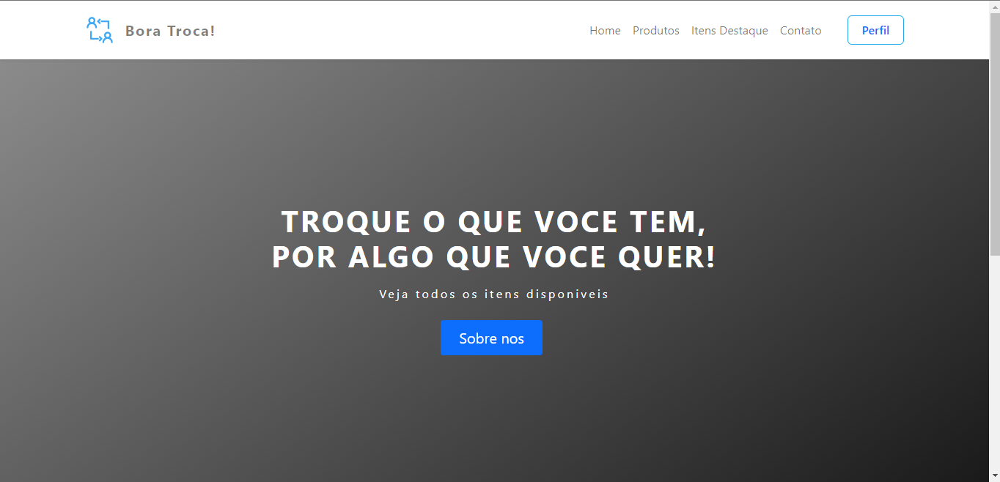
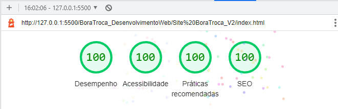

<h1 align="center">
   Bora Troca
</h1>

  <a href="https://boratroca.netlify.app/">
    <b>🚀Acesse o projeto em funcionamento 🚀</b>
  </a>

<h4 align="center">
  Pagina Web do Bora Troca com melhorias
</h4>

<h6 align="center">
  O projeto tem com intuito apresentar a navegação entre paginas do sistema, assim como as principais funcionaliaddes
</h6>

## 📚 Seções
O projeto é composto por uma pagina que contem 6 paginas, e aqui listarei as principais:

- **Inicio:** Lista todos os anuncios disponiveis na plataforma e o acesso aos mesmos;
- **Chat:** Pagina que tem como objetivo a interação entre dois usuarios por meio de um chat;
- **Produtos em destaque:** Lista de destaque de principais produtos;
- **Tela de Cadastro:** Cadastre um novo item para disponibilza-lo para troca;

****

---
### 🔦 Lighthouse
Ao longo da criação do projeto tivemos como foco a acessibilidade e boas praticas assim atingindo os seguintes resultados no lighthouse:

---

#### 💼 Tecnologias utilizadas
Para o desenvolvimento deste projeto foram utilzadas as seguintes tecnologias:

- HTML;
- CSS;
- Bootstrap;
- JavaScript;
- Netlify;

---

#### Autores
Patricia Lais Castilho Ventura Gomes;
Willian Stephano;
Flávio Aparecido Barbosa de Almeida;
Ricardo Santos Ferreira;