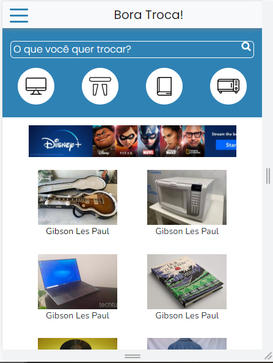

<h1 align="center">
   Bora Troca - Padrao Figma
</h1>

  <a href="https://grand-nasturtium-b97389.netlify.app/">
    <b>🚀Acesse o projeto em funcionamento 🚀</b>
  </a>

  <a href="https://www.figma.com/file/j84wH2CoMCiHfNyRcP4QS5/Bora-troca-Prot%C3%B3tipo-de-Alta-Fidelidade?node-id=0%3A1">
    <b>Acesse o projeto no Figma</b>
  </a>

<h4 align="center">
  Projeto criado seguindo os requisitos da atividade da disciplina Desenvolvimento Web
</h4>

<h6 align="center">
  Conforme solicitado o projeto atende o solitado de seguir o padrao de layout unico e exclusivamente para smartphones desenvolvido na disciplina de Design Digital. Portanto, para obter uma boa experiencia abra o projeto em um dispositivo movel.
</h6>

## 📚 Seções
O projeto é composto por uma pagina que contem 12 paginas, e aqui listarei as principais:

- **Anuncio:** Informações gerais sobre um produto disponivel;
- **Chat:** Pagina que visa a interação entre dois usuarios por meio de um chat;
- **Pagina Principal:** Lista todos os anuncios disponiveis;
- **Tela de Cadastro:** Cadastre um novo item para disponibilza-lo para troca;

****

---

## 💼 Tecnologias utilizadas
Para o desenvolvimento deste projeto foram utilzadas as seguintes tecnologias:

- HTML;
- CSS;
- Bootstrap;

---

#### Autores
Flávio Aparecido Barbosa de Almeida;
Patricia Lais Castilho Ventura Gomes; 
Ricardo Santos Ferreira;
Willian Stephano;

